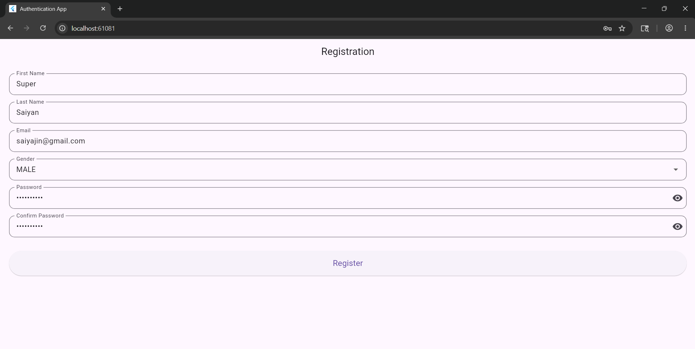
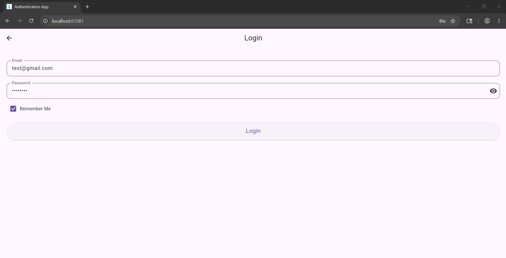
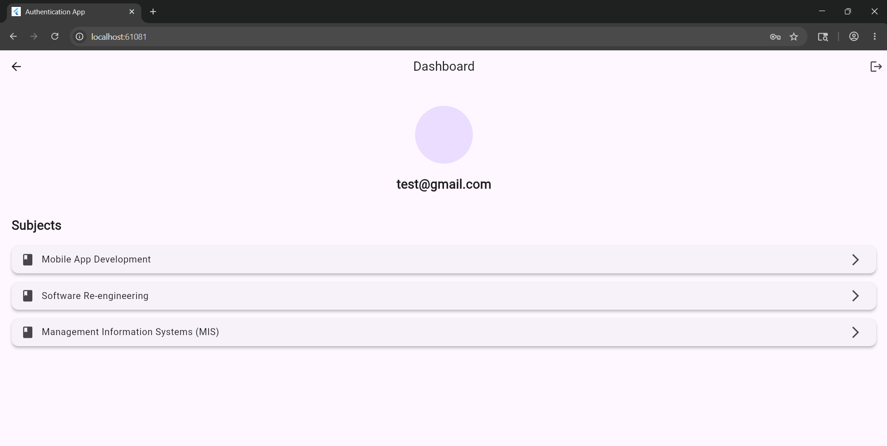
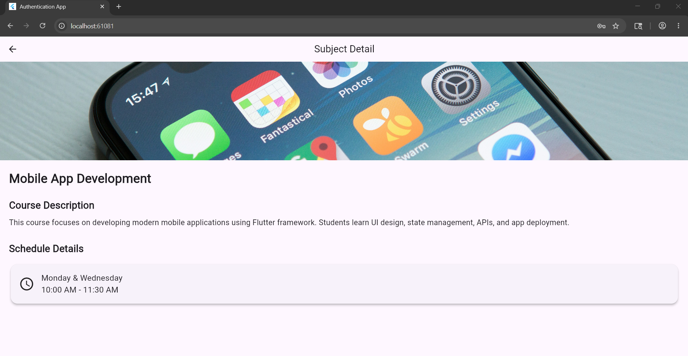
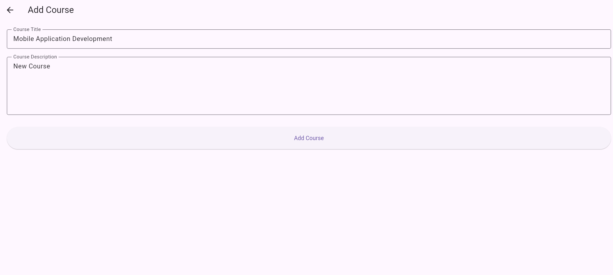
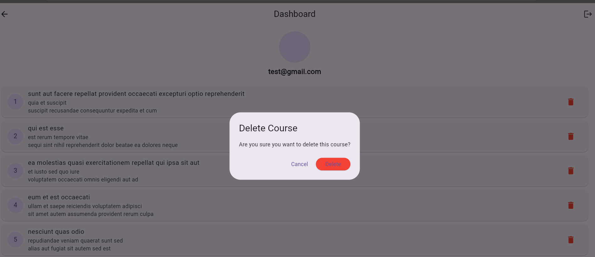

# Flutter Course Dashboard App

## Project Title
Flutter Course Dashboard App

---

## Student Information
- Name: Syed Muhammad Shaheer Kamal
- Student ID: SE221026

---

## Project Description
This Flutter application is a multi-screen authentication system with a course dashboard. It includes:

- User Registration with validation
- Login system with session persistence
- Dashboard displaying user info and subjects
- Subject detail screen with dynamic content
- Logout functionality
- Clean architecture using controllers, validators, and enums

---

## Features

### Registration Screen
- First name & last name input
- Email validation
- Gender selection (Enum)
- Strong password validation
- Confirm password check
- Real-time validation
- Disabled submit button until valid

### Login Screen
- Email validation
- Password visibility toggle
- Remember Me checkbox
- Session persistence using SharedPreferences
- Navigation to Dashboard

### Dashboard Screen
- User email display
- Avatar placeholder
- Subject list
- Navigation to subject details
- Logout functionality

### Detail Screen
- Subject banner image
- Course description
- Class schedule
- Dynamic content per subject

---

## State Management & Architecture
- Controller-based architecture
- Reusable Validator class
- Enum usage for Gender and Auth State
- Separation of UI and business logic

---

## API Used
This project uses JSONPlaceholder API for CRUD operations.

API Base URL:
https://jsonplaceholder.typicode.com/posts

---

## Documentation Reference
API documentation followed:
https://jsonplaceholder.typicode.com/guide

---

## Branch Information
Feature branch used for submission:
feature/course-api-integration

---

## Technologies Used
- Flutter
- Dart
- SharedPreferences
- Material Design

---

## How to Run the Project

1. Clone repository
2. Run:

---

## Screenshots

- Registration Screen  

  

- Login Screen  

  

- Dashboard Screen  

  

- Detail Screen  

  

- Add Course

  
  
- Edit Course

  

- Delete Course

  

---

## Author
Muhammad Farrukh Iqbal

